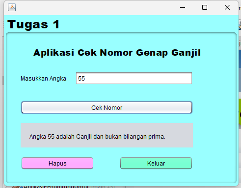

# Aplikasi Cek Angka Ganjil Genap 
 
 Aplikasi Cek Angka adalah sebuah aplikasi berbasis java yang membantu pengguna dalam menghitung angka Yaitu Melakukan Input Angka, Apakah Angka Yang Kita input berupa Ganjil atau Genap

# Keunggulan Aplikasi

- *Cek Ganjil Genap*: Aplikasi ini untuk Melakukan Pemeriksaan Angka Ganjil Atau Genap.

# Pembuat Aplikasi
 Muthya Adylla - 2210010476 - Tugas 1

# Fitur

Aplikasi ini menawarkan fitur:

*Penghitungan Dua Angka  
Cek Angka Ganjil Atau Genap 

## Cara Menjalankan

1. Run File
2. Ketikkan Angka Yang Kita Input
3. Tekan Cek Bada Button Cek
4. Maka Hasil Akan Tampil, Tekan Hapus pada Button Hapus, Jika Ingin Menghapus, dan Tekan Button Keluar, jika ingin keluar 

# Demo
 
